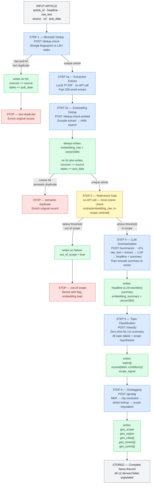

# NLP Pipeline for Alternative Mobility News Processing
### Masters NLP Seminar — Technical Report

---

## Abstract

This report describes a modular natural language processing service designed to ingest, deduplicate, summarise, classify, and geotag Spanish-language news articles about alternative urban mobility. The system targets a community forum platform that aggregates coverage of cycling infrastructure, micro-mobility, and sustainable transport policy across Spain. A sequential six-step pipeline coordinates four independent NLP modules — deduplication, summarisation, topic classification, and geotagging — each exposed as a self-contained REST endpoint and backed by a dedicated model stack. Cost-aware ordering ensures that the most expensive operations (LLM generation, ~47 s per article) only run on articles that pass cheaper upstream gates. The service is deployed as a Docker container alongside a locally-hosted large language model, accessed entirely through a typed HTTP API.

---

## 1. Introduction and Motivation

Online communities focused on sustainable transport face a common editorial problem: the same news event is reported by dozens of sources, coverage ranges from hyper-local (a new cycle lane in a specific district) to national policy announcements, and the geographic and thematic context varies widely. Manual curation at scale is not feasible.

The service described here automates the ingestion pipeline for a Spanish urban mobility forum. Every incoming article passes through a sequence of NLP operations that (a) detect whether it has already been processed under a different byline, (b) assess whether it is relevant to the platform's editorial scope, (c) generate a compact LLM summary, (d) assign multi-label topic tags from a curated taxonomy, and (e) resolve all place mentions to structured geographic entities — cities, streets, and administrative regions.

The resulting enriched record supports downstream features including geographic search, topic filtering, article deduplication in the frontend, and vector-similarity-based content recommendations.

The design follows three engineering principles:

- **Minimal coupling.** Each NLP module operates as an independent microservice endpoint. The orchestrating pipeline is not aware of model internals; it only sends HTTP requests and reads typed responses.
- **Cost-aware ordering.** Expensive steps are gated behind cheap ones. An article that is a duplicate or out of scope never reaches the LLM.
- **Reusable components.** The sentence encoder, the NLI model, and the geotagger each have uses outside the ingestion pipeline (semantic search, content recommendation, map-based browsing) and are exposed independently.

---

## 2. System Architecture Overview

The system is composed of four independent NLP service modules, a thin orchestration layer (the ingestion pipeline), and a PostgreSQL database extended with a vector index. An Ollama instance, running as a Docker sidecar, hosts the generative LLM used by the summariser.

```
┌──────────────────────────────────────────────────────┐
│                  Ingestion Orchestrator               │
│    (external process; calls NLP service endpoints)    │
└──────┬──────────┬─────────────┬──────────────────────┘
       │          │             │
       ▼          ▼             ▼
 ┌──────────┐ ┌──────────┐ ┌──────────┐ ┌──────────┐
 │  DEDUP   │ │SUMMARIZER│ │CLASSIFIER│ │GEOTAGGER │
 │ /dedup-* │ │/summarize│ │/classify │ │ /geotag  │
 └──────────┘ └────┬─────┘ └──────────┘ └──────────┘
                   │
             ┌─────▼──────┐
             │   Ollama   │  (LLM sidecar, Docker)
             │  /api/gen  │
             └────────────┘
                   │
        ┌──────────▼──────────┐
        │  PostgreSQL + pgvec │  (news table, vector indexes)
        └─────────────────────┘
```

All four NLP modules are implemented as FastAPI routers within a single deployable service. This means they share a process and therefore share model instances loaded into memory (the sentence encoder and NLI model are loaded once and reused across endpoints). The orchestrator is a separate process — typically a cron job or event-driven ingestion script — that drives articles through the pipeline by calling the service's HTTP API.

---

## 3. NLP Module Architecture

The diagram below shows the internal processing steps of each module, described in terms of what each component does rather than which library implements it.

**Figure 1 — NLP Module Internal Processes**

```mermaid
flowchart TB

  subgraph DEDUP["DEDUP MODULE   ·   /dedup-check  &  /dedup-check-embed"]
    direction LR
    da["raw_text"] --> db["Shingling + Hashing\nConvert text into overlapping N-gram sets\nHash each shingle into a compact bit signature\nResult: MinHash fingerprint of the article"]
    db --> dc["LSH Band Lookup\nSplit fingerprint into bands\nProbe hash buckets for any article\nthat shares at least one band"]
    dc -->|"Jaccard hit\napprox. text duplicate"| dd["DUPLICATE\nEnrich original record:\nadd source + date to arrays\nDo not store new article"]
    dc -->|"No hit"| de["extract (~200 words)\nfrom extractive step"]
    de --> df["Multilingual Sentence Encoder\n384-dim transformer vector\nCaptures semantic meaning\nacross Spanish, English, etc."]
    df --> dg["Approximate Nearest-Neighbor Search\nQuery persisted vector index\nMeasure cosine distance to all\nstored article embeddings"]
    dg -->|"Cosine hit\nsemantic duplicate"| dd
    dg -->|"No hit"| dh["NOT DUPLICATE\nReturn: embedding_raw vector\nUpdate MinHash + vector indexes\nVector persisted to database"]
  end

  subgraph SUMMARIZER["SUMMARIZER MODULE   ·   /summarize"]
    direction LR
    sa["raw_text + headline"] --> sb["TF-IDF Sentence Scoring\nWeight each term by:\nfrequency in this article\nvs rarity across all articles"]
    sb --> sc["Extractive Selection\nPick top-ranked sentences\nup to ~200-word budget\nFast, no model needed"]
    sc --> sd["LLM Prompted Generation\nContext: raw_text + extract\nTask: rewrite headline +\nproduce 3-sentence summary\n~47s runtime per article"]
    sd --> se["Encode Generated Summary\nSame 384-dim transformer\nCaptures topic-level semantics\nDistinct signal from embedding_raw"]
    se --> sf["Output:\nheadline · summary · embedding_summary"]
  end

  subgraph CLASSIFIER["CLASSIFIER MODULE   ·   /classify"]
    direction LR
    ca["summary text"] --> cb["Zero-Shot NLI per Topic Label\nFor each label, form hypothesis:\n'Este articulo trata sobre label'\nScore via Natural Language Inference\nNo training examples needed"]
    cb --> cd["Multi-Label Threshold\nKeep all labels above\nconfidence cutoff\nMultiple topics allowed per article"]
    ca --> cc["Scope Hypothesis Test\n2 competing sentences tested:\nnational-level mobility coverage\nvs specific-region coverage\nNLI picks highest-scoring one"]
    cd --> ce["Output:\ntopics[] · scores{label: float}\nscope_signal: national or regional or null"]
    cc --> ce
  end

  subgraph GEOTAGGER["GEOTAGGER MODULE   ·   /geotag"]
    direction LR
    ga["raw_text · headline\nscope_signal"] --> gb["Stage A — Token-Level NER\nSpanish-fine-tuned transformer\nclassifies every token:\nLOC / GPE / FAC / Other\nGrouped into place-name spans"]
    gb --> gc["Street Prefix Regex\nDetect prefix patterns:\nCalle, Avenida, Plaza, Paseo, C., Avda.\nTag matched spans as type: street"]
    gc --> gd["Pass B1 — City Resolution\nGeoNames gazetteer lookup\nPopulated-place feature class only\nScore: population weight\n+ headline mention bonus\n+ news-source city prior"]
    gd --> ge["Pass B2 — Street Resolution\nNormalize: lowercase, strip accents,\nremove street prefix\nLookup in city-scoped street index\nFallback: GeoNames inside city bbox"]
    ge --> gf["Pass B3 — Regional / Point\nRemaining spans hit GeoNames\nadmin-boundary feature class\nReturn raw lat/lon from gazetteer"]
    gf --> gg["Scope Imputation\nNLI scope_signal wins if present\nElse infer from geo results:\ncity hits found → city scope\nonly regions found → regional\nnothing found → national fallback"]
    gg --> gh["Output:\ngeo_scope · geo_region\ngeo_cities[] · geo_streets[] · geo_points[]"]
  end
```



### 3.1 Deduplication Module

The deduplication module runs two complementary checks, designed to catch different kinds of repetition.

The first check operates on the raw article text using text shingle fingerprinting. The article is tokenised into overlapping N-gram windows; each N-gram is hashed into a compact integer. The resulting set of hash values is reduced to a fixed-size MinHash signature — a compact binary representation that approximates the Jaccard similarity between two documents without comparing them directly. This signature is then probed against a Locality-Sensitive Hash (LSH) index: the signature is split into bands, each band hashed into a bucket, and a candidate match is flagged if any bucket is shared. This approach scales to millions of stored articles with sub-linear query time.

The second check operates on the 200-word extractive summary rather than the full article, which avoids the 512-token truncation that would otherwise silently drop the second half of long pieces. The extract is passed through a multilingual transformer encoder that produces a 384-dimensional dense vector. This vector is compared against a persisted approximate nearest-neighbour index using cosine distance. This check catches paraphrased or structurally rewritten articles that would evade the Jaccard check.

Crucially, on a duplicate hit the system does not discard the new article — it enriches the existing record by appending the new source and date to the `sources` and `dates` arrays. This preserves cross-publication coverage data.

### 3.2 Summarisation Module

The summariser operates in three stages. First, a TF-IDF scoring step ranks every sentence in the article by a salience signal derived from term frequency within the document relative to the inverse frequency of each term across the full corpus. This is a computationally trivial operation (no neural model) that produces a ranked sentence list in milliseconds. The top-ranking sentences up to approximately 200 words form the extractive summary.

The extractive summary is then passed to a locally-hosted large language model along with the full raw text as context. The model is prompted to rewrite the headline and produce a three-sentence narrative summary of the article. This operation takes approximately 47 seconds per article on available hardware and is therefore deliberately restricted to articles that have passed the upstream relevance gate.

The LLM-generated summary is then encoded by the same multilingual transformer used in the dedup module, producing a second 384-dimensional vector (`embedding_summary`). This vector captures the distilled semantic content of the article and is designed for user-facing semantic search — matching user queries against what the article is fundamentally about, rather than its surface vocabulary.

### 3.3 Classification Module

Topic classification uses zero-shot Natural Language Inference (NLI), a transfer learning technique that repurposes a model trained on textual entailment tasks to classify text without any task-specific training examples. For each label in the configured topic taxonomy, the system forms a hypothesis sentence — for example, *"Este artículo trata sobre infraestructura ciclista"* — and scores the probability that the article summary entails this hypothesis. Labels scoring above a configurable threshold are retained, and since the threshold is applied independently per label, an article may carry multiple topic tags.

The same NLI call simultaneously scores two scope hypotheses: one asserting national-level policy coverage, one asserting regional or city-specific coverage. The hypothesis with the higher score above threshold becomes the `scope_signal`, which is forwarded as input to the geotagging step. This design avoids loading a separate model for scope detection, adding only two extra forward passes to a call that is already running over a full label list.

The topic taxonomy itself is defined in a YAML configuration file and can be updated without modifying any code. Taxonomy labels were developed using a hybrid approach: top-down editorial categories (infrastructure, policy, incidents, operations) combined with bottom-up cluster labels discovered via topic modelling on the full article corpus.

### 3.4 Geotagging Module

The geotagging module resolves free-text place mentions to structured geographic entities through two explicitly separated stages.

**Stage A — Toponym identification.** A Spanish-language transformer fine-tuned on a large Spanish news corpus performs token-level named entity recognition, classifying every token as one of: location, geopolitical entity, facility, or other. Consecutive tagged tokens are grouped into place-name spans. A post-NER regular expression layer checks each span for street prefix patterns (*Calle, Avenida, Plaza, Paseo, C., Avda.*) and marks matching spans with a `hint=street` flag. This flag bypasses the GeoNames city lookup in Stage B and routes the span directly to the street index.

**Stage B — Toponym resolution.** Resolution proceeds in three passes. Pass B1 resolves city-type spans against the GeoNames gazetteer filtered to the populated-place feature class, scoring candidates by population weight, headline mention bonus, and a learned prior that maps news sources to their most frequently covered cities. Pass B2 resolves street spans scoped to the city identified in B1: the span is normalised (lowercased, accent-stripped, prefix-removed) and looked up in a per-city street index keyed by city identifier. Pass B3 handles remaining unresolved spans by querying GeoNames for administrative boundary records and returning raw latitude/longitude coordinates as point entities.

After resolution, a scope imputation pass reconciles the NLI scope signal with the geographic evidence. The NLI signal takes precedence if present; otherwise, scope is inferred from the set of resolved entities (city-type hits imply city scope; regional entities imply regional scope; no geographic hits default to national scope).

---

## 4. Processing Pipeline

The six-step pipeline is orchestrated by an external ingestion script that drives articles through the NLP service endpoints in sequence. Each step may terminate processing early for cost or relevance reasons.

**Figure 2 — Pipeline Orchestration, Rules, and Field Completion**



### 4.1 Ordering Rationale

The pipeline order reflects a deliberate trade-off between signal quality and computational cost.

Deduplication runs first because the fastest check (MinHash text similarity) costs microseconds and eliminates redundant work immediately. The embedding-based dedup runs second — after the extractive step — because the same vector it produces is reused without re-encoding by the relevance gate in Step 3. This means the 384-dim encode operation happens exactly once per article, regardless of how many downstream steps consume it.

The relevance gate sits at Step 3 rather than Step 1 because it requires the embedding, which itself requires the extractive step. Placing it before the LLM call ensures that out-of-scope articles never incur the 47-second generation cost.

Topic classification runs on the LLM summary rather than the raw text because the summary fits within the NLI model's 512-token context window without truncation, and because its compressed, salient language produces more reliable classification scores. The scope hypothesis is bundled into the same NLI call to avoid a redundant model forward pass.

Geotagging runs last because it depends on the scope signal from Step 5, and because NER and gazetteer lookup — while not as expensive as LLM generation — add meaningful latency that should only be incurred for articles confirmed to be in scope.

---

## 5. Database Schema and Field Completion

Each article is stored as a single row in the `news` table. The following fields are added to the base schema by the NLP pipeline:

| Field | Type | Written at Step | Description |
|---|---|---|---|
| `sources` | `JSONB [{name, link, date}]` | 1 or 2b (on duplicate) | Array of all known source publications for this article; appended on each duplicate hit |
| `dates` | `JSONB [date]` | 1 or 2b (on duplicate) | Array of publication dates, one per source occurrence |
| `embedding_raw` | `vector(384)` | 2b | 384-dim L2-normalised encoding of the extractive extract; used for dedup, relevance gate, and topic proximity |
| `out_of_scope` | `BOOLEAN` | 3 (on OOS exit) | Set to `true` for articles that fall below the relevance centroid threshold; all downstream fields are null |
| `headline` | `TEXT` | 4 | LLM-rewritten headline; replaces the original scraped headline |
| `summary` | `TEXT` | 4 | Three-sentence narrative summary generated by the LLM |
| `embedding_summary` | `vector(384)` | 4 | 384-dim L2-normalised encoding of the LLM summary; used for semantic search; null for out-of-scope articles |
| `topics` | `JSONB [label]` | 5 | Multi-label topic assignments from the NLI classifier |
| `scores` | `JSONB {label: float}` | 5 | Raw NLI confidence score per topic label |
| `scope_signal` | `TEXT` | 5 | NLI-derived scope indicator: `national`, `regional`, or `null` |
| `geo_scope` | `TEXT` | 6 | Final geographic scope after imputation: `national`, `regional`, or `city` |
| `geo_region` | `TEXT` | 6 | Resolved region name (comunidad autónoma or provincia), if applicable |
| `geo_cities` | `JSONB [{city_id, city_name, confidence}]` | 6 | City entities resolved from place mentions |
| `geo_streets` | `JSONB [{span, edge_ids, city_id}]` | 6 | Street entities resolved to routing graph edge identifiers |
| `geo_points` | `JSONB [{span, lat, lon, geonames_id}]` | 6 | Unresolvable place mentions with GeoNames coordinates |

The two vector columns are indexed for fast approximate nearest-neighbour queries using IVFFlat, a partitioned inverted file structure that groups vectors into clusters for sub-linear search:

```sql
CREATE INDEX ON news USING ivfflat (embedding_raw vector_cosine_ops)     WITH (lists = 50);
CREATE INDEX ON news USING ivfflat (embedding_summary vector_cosine_ops) WITH (lists = 50);
```

The `embedding_raw` index supports the OOD centroid similarity check and topic-proximity queries. The `embedding_summary` index supports user-facing semantic search, where a query is encoded by the same model and matched against article summaries by cosine similarity.

---

## 6. Modularity and Component Reuse

A core design goal is that each NLP module should be independently callable. This serves two purposes: it simplifies testing (individual endpoints can be evaluated without running the full pipeline), and it enables reuse of the same components in different contexts.

**Independent REST endpoints.** Each module is exposed under its own route with a typed request/response schema. The pipeline orchestrator holds no knowledge of model internals; a module can be replaced by a different implementation as long as the API contract is preserved.

**Shared model instances.** The multilingual sentence encoder is used by both the deduplication module (to produce `embedding_raw`) and the summarisation module (to produce `embedding_summary`). Because both modules live in the same service process, the model is loaded into memory once at startup and shared. This is a deliberate coupling at the deployment level, not at the code level — the modules remain logically independent.

**Configurable taxonomy.** Topic labels and relevance thresholds are read from a YAML configuration file at startup. Adding, removing, or renaming labels requires only a configuration change and a service restart; no code modification is needed. The zero-shot NLI approach means no retraining is required either.

**Replaceable LLM.** The summariser communicates with the LLM exclusively through the Ollama HTTP API. Switching to a different model requires only updating the model name in the configuration and pulling the new model into the Ollama container. The service code is unaffected.

**Reuse outside the pipeline.** Because every module is a standalone endpoint, downstream platform features can call them directly:

- The `/dedup-check-embed` endpoint can be called during user content submission to check user-generated posts against the article corpus.
- The `/classify` endpoint can be applied to forum thread titles for automatic categorisation.
- The `/geotag` endpoint can power a map-based article browser, called on-demand per article view.
- The `/summarize` endpoint can generate summaries for articles ingested through alternative paths.

---

## 7. Deployment

The service is deployed as a set of Docker containers orchestrated with Docker Compose. The minimum configuration includes three services: the NLP API, the Ollama LLM sidecar, and the PostgreSQL database.

```yaml
# docker-compose.yml (reference configuration)
services:

  nlp-service:
    build: .
    ports:
      - "8000:8000"
    environment:
      OLLAMA_HOST: http://ollama:11434
      OLLAMA_TIMEOUT: "120"
      OLLAMA_MODEL: "llama3"
      TOPICS_YAML_PATH: /app/config/topics.yaml
      GEONAMES_PATH: /app/nlp/geotagger/data/geonames_es.tsv
      CITIES_SNAPSHOT_PATH: /app/nlp/geotagger/data/cities_snapshot.json
      STREET_INDEX_PATH: /app/nlp/geotagger/data/street_index.json
      SOURCE_CITY_PRIOR_PATH: /app/nlp/geotagger/data/source_city_prior.json
      FAISS_INDEX_PATH: /app/data/faiss.index
      MINHASH_INDEX_PATH: /app/data/minhash.pkl
      DATABASE_URL: postgresql://user:pass@db:5432/mobility
    depends_on:
      - ollama
      - db
    volumes:
      - ./data:/app/data          # persisted FAISS + MinHash indexes

  ollama:
    image: ollama/ollama
    volumes:
      - ollama-models:/root/.ollama
    ports:
      - "11434:11434"

  db:
    image: pgvector/pgvector:pg16
    environment:
      POSTGRES_USER: user
      POSTGRES_PASSWORD: pass
      POSTGRES_DB: mobility
    volumes:
      - pgdata:/var/lib/postgresql/data

volumes:
  ollama-models:
  pgdata:
```

**Model initialisation.** On first startup, the sentence encoder and NLI model are downloaded from HuggingFace and cached inside the container. The Ollama model must be pulled separately:

```bash
docker compose exec ollama ollama pull llama3
```

**FAISS and MinHash index persistence.** Both deduplication indexes are written to the host-mounted `./data` volume. On restart, the service reloads them from disk. If the volume is empty (first run), the indexes are initialised empty.

**Scaling considerations.** The NLP service is stateful with respect to the in-memory FAISS and MinHash indexes, which are read/write during normal operation. Horizontal scaling therefore requires an external index store (or read-only replicas). The Ollama container is stateless beyond model weights and can be scaled independently if summarisation throughput becomes the bottleneck.

---

## 8. API Reference

All endpoints accept and return `application/json`. The base URL is `http://nlp-service:8000`.

| Method | Endpoint | Input | Output |
|---|---|---|---|
| `POST` | `/dedup-check` | `{article_id, text}` | `{duplicate_of: id\|null}` |
| `POST` | `/dedup-check-embed` | `{article_id, extract}` | `{duplicate_of: id\|null, embedding: float[384]}` |
| `POST` | `/summarize` | `{article_id, text, headline}` | `{headline, summary, embedding_summary: float[384]}` |
| `POST` | `/classify` | `{article_id, text}` | `{topics: str[], scores: {str: float}, scope_signal: str\|null}` |
| `POST` | `/geotag` | `{article_id, text, headline, scope_signal?}` | `{geo_scope, geo_region, geo_cities[], geo_streets[], geo_points[]}` |
| `POST` | `/ollama/generate` | Ollama generate request | Ollama generate response |
| `GET` | `/ollama/tags` | — | `{models: [{name, size, ...}]}` |

The `/ollama/generate` and `/ollama/tags` endpoints are transparent proxies to the Ollama sidecar. They exist to give external clients (such as the evaluation notebook) a single network endpoint without needing direct access to the Ollama container.

---

## 9. Discussion

### Two-Embedding Strategy

A distinctive feature of the design is the deliberate use of two distinct embedding vectors per article derived from the same encoder model. `embedding_raw` is computed from the extractive extract — a representative sample of the full article — and serves as a general-purpose domain signal useful for deduplication, relevance gating, and topic proximity ranking. `embedding_summary` is computed from the LLM-generated summary and serves as a compact, distilled representation of what the article is about, suited for user-facing semantic search where precision over recall is preferable.

Using a single vector for both purposes would introduce a tension: the dedup and relevance gate benefit from a vector that captures full-article domain signal, while semantic search benefits from a vector that captures only the salient content. The two-vector approach resolves this tension with a single model instance and two encode calls per article.

### Relevance Gating

The current relevance gate uses cosine similarity to a centroid computed from a reference set of confirmed in-scope articles. This centroid-based out-of-distribution (OOD) detection approach is more robust than the previous NLI entailment approach, which exhibited a false rejection rate of 0.57 on the evaluation set. The centroid can be updated incrementally as the reference set grows, without retraining any model.

### Scope Determination

Geographic scope is determined through a two-pass process that combines a learned signal (NLI scope hypothesis) with a structural signal (what entities were actually resolved). The NLI signal takes precedence because it reflects the article's editorial framing, not just what place names appear in the text. An article about a national cycling strategy that happens to mention Madrid should be classified as national scope, not city scope. The geo evidence is used to fill in the NLI signal when it is absent (score below threshold), providing a sensible fallback.

---

## 10. Conclusion

The described system demonstrates how a sequence of relatively standard NLP techniques — locality-sensitive hashing, extractive summarisation, large language model generation, zero-shot natural language inference, and named entity recognition — can be combined into a coherent, cost-efficient production pipeline for a specific domain application. The modular architecture ensures that each component can be tested, replaced, or reused independently, while the pipeline ordering ensures that the most expensive operations are only incurred by articles that have cleared all upstream quality gates.

The deployment model — a containerised FastAPI service alongside a locally-hosted LLM — keeps all processing within the platform's infrastructure, avoiding per-call API costs and preserving data privacy. The typed HTTP API makes the NLP capabilities accessible to any service in the platform stack without any dependency on the underlying model stack.

---

*Masters NLP Seminar — Technical Report*
*System: NLP Pipeline for Alternative Mobility News*
*Language: Spanish (ES) — Domain: Urban and alternative mobility, Spain*
