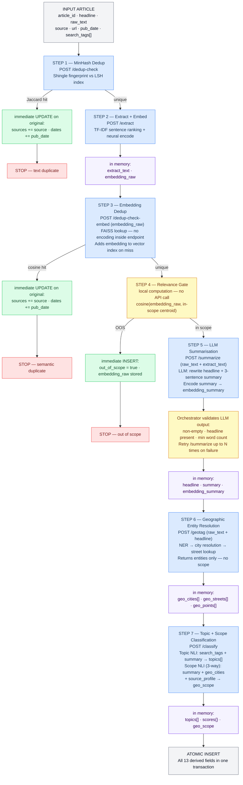

# NLP Pipeline for Alternative Mobility News Processing
### Masters NLP Seminar — Technical Report

---

## Abstract

This report describes a modular natural language processing service designed to ingest, deduplicate, summarise, classify, and geotag Spanish-language news articles about alternative urban mobility. The system targets a community forum platform that aggregates coverage of cycling infrastructure, micro-mobility, and sustainable transport policy across Spain. A sequential pipeline coordinates six independent NLP endpoints — extraction and embedding, deduplication, summarisation, geographic entity resolution, and a fused topic and scope classifier — each exposed as a self-contained REST endpoint and backed by a dedicated model stack. Cost-aware ordering ensures that the most expensive operations (LLM generation, ~47 s per article) only run on articles that pass cheaper upstream gates. The classifier fuses the generated summary, resolved geographic evidence, a source profile, and the scraper's original search tags into a single joint inference step for both topic tagging and geographic scope determination. The orchestrator accumulates all results in memory, validates and retries the LLM output, and writes a single atomic database record only on full pipeline completion. The service is deployed as a Docker container alongside a locally-hosted large language model, accessed entirely through a typed HTTP API.

---

## 1. Introduction and Motivation

Online communities focused on sustainable transport face a common editorial problem: the same news event is reported by dozens of sources, coverage ranges from hyper-local (a new cycle lane in a specific district) to national policy announcements, and the geographic and thematic context varies widely. Manual curation at scale is not feasible.

The service described here automates the ingestion pipeline for a Spanish urban mobility forum. Every incoming article passes through a sequence of NLP operations that (a) detect whether it has already been processed under a different byline, (b) assess whether it is relevant to the platform's editorial scope, (c) generate a compact LLM summary, (d) resolve all place mentions to structured geographic entities, and (e) assign multi-label topic tags and a geographic scope from a joint inference step that fuses textual, geographic, and editorial signals.

The resulting enriched record supports downstream features including geographic search, topic filtering, article deduplication in the frontend, and vector-similarity-based content recommendations.

The design follows three engineering principles:

- **Minimal coupling.** Each NLP endpoint operates as an independent microservice. The orchestrating pipeline is not aware of model internals; it only sends HTTP requests and reads typed responses.
- **Cost-aware ordering.** Expensive steps are gated behind cheap ones. An article that is a duplicate or out of scope never reaches the LLM.
- **Signal fusion at inference time.** Rather than classifying scope from summary text alone and then reconciling with geographic evidence in a post-hoc imputation step, all available evidence — textual, geographic, and editorial — is assembled into a single joint inference call. This removes the imputation heuristic and gives the NLI model visibility over all signals at once.

---

## 2. System Architecture Overview

The system is composed of six independent NLP endpoints, a thin orchestration layer, and a PostgreSQL database extended with a vector index. An Ollama instance, running as a Docker sidecar, hosts the generative LLM used by the summariser.

```
┌──────────────────────────────────────────────────────────────────┐
│                      Ingestion Orchestrator                       │
│  Drives pipeline · validates LLM output · retries on failure     │
│  Holds all results in memory → one atomic DB write at the end    │
└───┬──────┬──────┬───────────┬──────────────┬─────────────────────┘
    │      │      │           │              │
    ▼      ▼      ▼           ▼              ▼
┌──────┐┌──────┐┌──────┐ ┌──────────┐ ┌──────────┐ ┌──────────┐
│EXTR  ││DEDUP ││SUMM  │ │GEOTAGGER │ │CLASSIFR  │ │  Ollama  │
│/extr ││/dup* ││/sum  │ │/geotag   │ │/classify │ │ (Docker) │
└──────┘└──────┘└──┬───┘ └──────────┘ └──────────┘ └────┬─────┘
                   └─────────────────────────────────────┘
                         (summariser calls Ollama)
                                    │
                       ┌────────────▼────────────┐
                       │  PostgreSQL + pgvector   │
                       │  (news · vector indexes) │
                       └─────────────────────────┘
```

All six endpoints are implemented as FastAPI routers within a single deployable service, sharing model instances loaded once at startup. The orchestrator is a separate process — a cron job or event-driven ingestion script — that calls the service's HTTP API, accumulates results in memory, and performs exactly one database write per article on the success path.

---

## 3. NLP Module Architecture

The diagram below shows the internal processing steps of each endpoint.

**Figure 1 — NLP Endpoint Internal Processes**

```mermaid
flowchart TB

  subgraph EXTRACTOR["EXTRACTOR   ·   /extract"]
    direction LR
    xa["raw_text"] --> xb["TF-IDF Sentence Scoring\nRank sentences by term frequency\nvs. corpus-wide rarity"]
    xb --> xc["Extractive Selection\nTop-ranked sentences\nup to ~200-word budget\nno model needed"]
    xc --> xd["Multilingual Encoder\n384-dim transformer vector\ncross-lingual semantic meaning"]
    xd --> xe["Output: extract_text\nembedding_raw: float[384]"]
  end

  subgraph DEDUP["DEDUP   ·   /dedup-check   /dedup-check-embed"]
    direction LR
    da["raw_text"] --> db["Shingling + Hashing\nN-gram sets → compact\nMinHash signature"] --> dc["LSH Band Lookup\nProbe buckets for\nJaccard-similar articles"]
    dc -->|"Jaccard hit"| dd["DUPLICATE\nduplicate_of: article_id"]
    dc -->|"No hit"| dh["NOT DUPLICATE"]
    de["embedding_raw\n(pre-computed)"] --> dg["ANN Vector Search\nCosine distance in\npersisted FAISS index"]
    dg -->|"Cosine hit"| dd
    dg -->|"No hit"| di["NOT DUPLICATE\nAdd to vector index"]
  end

  subgraph SUMMARIZER["SUMMARIZER   ·   /summarize"]
    direction LR
    sa["raw_text\nextract_text"] --> sd["LLM Generation\nContext: raw_text + extract\nTask: rewrite headline +\n3-sentence summary  ~47s"]
    sd --> sv["Orchestrator validates output\nnon-empty · headline present\nminimum word count\nRetries Ollama on failure"]
    sv --> se["Encode Summary\n384-dim transformer vector\ntopic-level semantic signal"]
    se --> sf["Output: headline · summary\nembedding_summary: float[384]"]
  end

  subgraph GEOTAGGER["GEOTAGGER   ·   /geotag  (entity resolution only)"]
    direction LR
    ga["raw_text · headline"] --> gb["Token-Level NER\nSpanish transformer: LOC/GPE/FAC\nGrouped into place-name spans"]
    gb --> gc["Street Prefix Regex\nCalle, Avda, Plaza...\nhint = street"]
    gc --> gd["Pass B1 — City Resolution\nGeoNames populated-place lookup\nScore: population + headline + source prior\nResult: city_id or null per span"]
    gd --> ge["Pass B2 — Street Resolution\nNormalize span, lookup in\ncity-scoped street index\nFallback: GeoNames in city bbox"]
    ge --> gf["Pass B3 — Point Fallback\nRemaining spans: GeoNames lat/lon\nReverse-geocode to nearest city"]
    gf --> gh["Output: geo_cities[]\ngeo_streets[] · geo_points[]\n(no scope — determined by classifier)"]
  end

  subgraph CLASSIFIER["CLASSIFIER   ·   /classify  (two NLI passes)"]
    direction LR
    ca["summary\ngeo_cities[]\nsearch_tags[]\nsource_profile"] --> cb["Topic NLI\nPremise: search_tags + summary\nHypothesis per label:\n'article is about label'\nMulti-label · independent thresholds"]
    cb --> cd["Topic output:\ntopics[] · scores{}"]
    ca --> cc["Scope NLI  (3-way)\nPremise: summary + serialised city evidence\n+ source profile context\nHypotheses: national / regional / city\nExclusive · pick highest above threshold"]
    cc --> cf["Scope output:\ngeo_scope: national or regional or city"]
    cd --> cg["Output: topics[]\nscores{} · geo_scope"]
    cf --> cg
  end
```



### 3.1 Extraction and Embedding (`/extract`)

The extraction endpoint is the pipeline's single producer of `embedding_raw`. It accepts raw article text and returns two outputs consumed by multiple downstream steps: a concise extractive summary and a 384-dimensional semantic vector.

Sentence ranking is computed via TF-IDF: each sentence receives a salience score from the frequency of its terms within the article weighted against the inverse frequency of those terms across the full corpus. The highest-scoring sentences are concatenated up to a 200-word budget. This step requires no neural model and runs in milliseconds.

The 200-word extract is then passed through a multilingual transformer encoder. Using the extract rather than the full raw text avoids the silent 512-token truncation that transformers impose on longer inputs — passing the full article would cause the second half to be discarded. The extract provides a representative whole-article signal within the model's context window.

This endpoint is the sole encoding boundary for `embedding_raw`. All downstream consumers — the FAISS dedup lookup, the OOD relevance gate, and the FAISS index update — receive the pre-computed vector. Upgrading the encoder model requires touching only this endpoint.

### 3.2 Deduplication (`/dedup-check`, `/dedup-check-embed`)

The deduplication module runs two complementary checks. Both endpoints return only `duplicate_of` (an article identifier or null); all database enrichment is handled by the orchestrator.

`/dedup-check` operates on raw text using MinHash fingerprinting. The article is tokenised into overlapping N-gram windows; each N-gram is hashed to an integer and the full set is reduced to a compact MinHash signature approximating the Jaccard similarity between documents. The signature is split into bands and probed against a Locality-Sensitive Hash index: a candidate match is flagged if any band bucket is shared. This scales to millions of stored articles with sub-linear query time.

`/dedup-check-embed` receives the `embedding_raw` vector already computed by `/extract` — it performs no encoding internally — and queries a persisted approximate nearest-neighbour index by cosine distance. This catches paraphrased or structurally rewritten articles that evade the Jaccard check. On a no-hit, it also adds the new embedding to the index so future queries will find this article.

On a duplicate hit from either endpoint, the orchestrator immediately enriches the existing record by appending the new source and date to the `sources` and `dates` arrays.

### 3.3 Summarisation (`/summarize`)

The summariser receives the raw article text together with the extract produced by `/extract`. It does not redo the extractive step. The locally-hosted LLM is prompted to rewrite the headline and produce a three-sentence narrative summary, using the extract as focused context alongside the full text. This operation takes approximately 47 seconds per article and is restricted to articles that have passed the upstream relevance gate.

**Output validation and retry (orchestrator-side).** After receiving the LLM response, the orchestrator validates it: the output must be non-empty, contain a recognisable headline, and meet a minimum word count. If validation fails the orchestrator retries the `/summarize` call up to a configured maximum before marking the article as failed. Validation logic lives in the orchestrator, not the endpoint, preserving the endpoint's independence.

The validated summary is encoded by the same multilingual transformer used in the extractor, producing `embedding_summary` — a 384-dimensional vector capturing the distilled semantic content of the article, optimised for user-facing search.

### 3.4 Geographic Entity Resolution (`/geotag`)

The geotagging endpoint resolves all place mentions to structured entities. It does **not** determine geographic scope — scope is the responsibility of the classifier, which runs after this step with access to the full resolved city set.

**Stage A — Toponym identification.** A Spanish-language transformer fine-tuned on a large Spanish news corpus performs token-level NER (LOC, GPE, FAC). A post-NER regular expression layer tags spans with street prefix patterns (*Calle, Avenida, Plaza, Paseo, C., Avda.*), routing them directly to the per-city street index.

**Stage B — Toponym resolution.** Every NER span is resolved to either a `city_id` (from the cities reference snapshot) or a `{lat, lon}` pair (from GeoNames). Coordinates without a direct city match are reverse-geocoded to the nearest city in the platform's coverage area. Pass B1 resolves city-type spans via GeoNames, scored by population weight, headline mention bonus, and a source-to-city prior. Pass B2 resolves street spans scoped to the winning city from B1, normalising the span and looking it up in a per-city street index. Pass B3 handles remaining unresolved spans via GeoNames administrative boundaries.

The endpoint returns `geo_cities[]`, `geo_streets[]`, and `geo_points[]` — the full set of resolved entities. Geographic scope is not included in the response; it is determined downstream by the classifier from the city evidence.

### 3.5 Topic and Scope Classification (`/classify`)

The classification endpoint performs two independent NLI passes on a composite input that includes the generated summary, the resolved city list from the geotagging step, scraper-provided search tags, and a pre-computed source profile.

**Topic NLI.** The premise is formed by prepending the scraper's search tags to the summary — e.g., *"Artículo buscado por: 'carril bici', 'bicicleta'. [summary text]"*. For each topic label, the NLI model scores the hypothesis *"Este artículo trata sobre {label}"* against this enriched premise. The search tags act as a soft editorial prior: articles retrieved under "carril bici" are more likely to concern cycling infrastructure, and the model can leverage this alongside the summary text. Labels above a configurable threshold are retained; since the threshold is applied independently per label, multiple topics may be assigned.

**Scope NLI (3-way, separate pass).** The premise is a composite of the summary text, the serialised city evidence from the geotagging step, and a source profile — e.g., *"[summary text] Se mencionan las ciudades: Madrid, Barcelona. La fuente cubre habitualmente: Cataluña."* Three mutually exclusive hypotheses are scored: `national` ("covers mobility policy at the national level in Spain"), `regional` ("covers a specific comunidad autónoma or province"), and `city` ("focuses on one or a small number of specific cities"). Running scope as a separate NLI pass from topics avoids the softmax interference that would occur if exclusive and independent hypotheses competed in the same normalisation. The hypothesis with the highest score above threshold becomes `geo_scope`.

The key improvement over the previous design is that geographic evidence is baked into the NLI premise rather than applied as a post-hoc imputation rule. The model sees the city list, the source profile, and the summary text simultaneously, allowing it to exploit the interaction between these signals (e.g., a summary mentioning a national policy that happens to list Madrid as an example should still score high on `national`).

---

## 4. Processing Pipeline

The pipeline is orchestrated by an external ingestion script. The orchestrator accumulates all results in Python variables and performs a single atomic database write only when all steps complete successfully. Early exits (duplicate, out-of-scope) write immediately since those paths are terminal. The geotagging step runs before classification so that resolved city evidence is available for the scope NLI call.

**Figure 2 — Pipeline Orchestration, Rules, and Field Completion**



### 4.1 Ordering Rationale

**Dedup first, extract second.** MinHash text fingerprinting costs microseconds. The `/extract` call runs immediately after because `embedding_raw` is consumed by three subsequent steps (FAISS dedup, relevance gate, FAISS index update) without re-encoding. One encode per article.

**Geotag before classify.** This is the key reordering relative to the initial design. The scope NLI call requires the resolved city list as part of its premise. Running the geotagging endpoint before classification makes this possible without requiring a separate partial-geotag step. The geotagging endpoint no longer accepts `scope_signal` as input — entity resolution is independent of scope.

**Scope determined by joint NLI, not post-hoc imputation.** The previous design ran NLI scope classification on summary text, then tried to reconcile the output with geographic evidence through imputation rules. The current design feeds all evidence (summary, city list, source profile) into the NLI call simultaneously. The model performs the fusion, producing a direct 3-way scope output. The imputation rule set is eliminated.

**Topic NLI enriched with search tags.** The scraper already records which query terms or category filters were used to retrieve each article. Prepending these to the summary text for the topic NLI call introduces a near-free editorial prior that strengthens classification without additional model calls or training.

**Separate NLI passes for topics and scope.** Topic labels are multi-label (independent thresholds); scope is 3-way exclusive (pick highest above threshold). Running them in the same softmax normalisation would cause the exclusive scope hypotheses to drain probability mass from the independent topic labels. Two calls cost two extra forward passes — negligible — and preserve the correctness of both outputs.

**Validation and retry in the orchestrator.** LLM output validation and retry logic lives in the orchestrator, not the `/summarize` endpoint. This keeps the endpoint stateless and simple, and allows the validation policy to be updated without redeploying the NLP service.

**Single atomic write.** The orchestrator holds all intermediate results in memory throughout steps 1–7 and issues one `INSERT` at the end. No intermediate writes means no partial records and no need for pipeline status tracking. The only exceptions are the early-exit paths (duplicate enrichment, OOS insertion), which are terminal and write immediately.

---

## 5. Database Schema and Field Completion

Each article is stored as a single row in the `news` table. Fields written on the main success path are committed atomically at the end of the pipeline. Fields marked as immediate write are produced by early-exit paths.

| Field | Type | Write timing | Description |
|---|---|---|---|
| `sources` | `JSONB [{name, link, date}]` | immediate (duplicate hit) | All known source publications; appended on each duplicate detection |
| `dates` | `JSONB [date]` | immediate (duplicate hit) | Publication dates per source occurrence |
| `embedding_raw` | `vector(384)` | immediate (OOS) / atomic (main) | Encoding of the extractive extract; for dedup, relevance gate, topic proximity |
| `out_of_scope` | `BOOLEAN` | immediate (OOS) | True if below relevance centroid threshold; all downstream fields null |
| `headline` | `TEXT` | atomic | LLM-rewritten headline |
| `summary` | `TEXT` | atomic | Three-sentence narrative summary |
| `embedding_summary` | `vector(384)` | atomic | Encoding of the LLM summary; for semantic search; null for OOS articles |
| `geo_cities` | `JSONB [{city_id, city_name, confidence}]` | atomic | Cities resolved from place mentions |
| `geo_streets` | `JSONB [{span, edge_ids, city_id}]` | atomic | Streets resolved to routing graph edge identifiers |
| `geo_points` | `JSONB [{span, lat, lon, geonames_id}]` | atomic | Coordinate-only place mentions |
| `topics` | `JSONB [label]` | atomic | Multi-label topic assignments |
| `scores` | `JSONB {label: float}` | atomic | Raw NLI confidence per topic label |
| `geo_scope` | `TEXT` | atomic | Geographic scope from joint NLI fusion: `national`, `regional`, or `city` |

Note: `geo_scope` is now written entirely by the classifier (`/classify` step 7), not by the geotagger. `geo_region` has been absorbed into `geo_scope`/`geo_cities` — a regional article's region is recoverable from the resolved city entities.

Vector indexes for sub-linear approximate nearest-neighbour queries:

```sql
CREATE INDEX ON news USING ivfflat (embedding_raw vector_cosine_ops)     WITH (lists = 50);
CREATE INDEX ON news USING ivfflat (embedding_summary vector_cosine_ops) WITH (lists = 50);
```

---

## 6. Modularity and Component Reuse

Each endpoint has a single, typed responsibility and can be called independently of the pipeline. The orchestrator is a pure HTTP client — it holds no knowledge of model internals, data file paths, or index state.

**Encoding ownership is explicit.** `/extract` is the sole producer of `embedding_raw`. All other endpoints either receive it as an input or produce their own embedding (`/summarize` produces `embedding_summary`). Upgrading the encoder model requires touching only `/extract` and `/summarize`; deduplication, the relevance gate, and search index consistency are preserved automatically.

**Geotagger is scope-agnostic.** The entity resolution endpoint (`/geotag`) returns resolved place entities and nothing more. It accepts no scope signal as input. This decouples entity resolution from scope classification entirely — the geotagger can be called independently for any place-resolution task without any pipeline context.

**Classifier receives assembled evidence.** The `/classify` endpoint accepts a structured input containing all signals required for joint inference. It does not call other endpoints or load geographic data files internally. If scope determination logic changes (different hypotheses, different model), only this endpoint needs updating.

**Configurable taxonomy.** Topic labels, scope hypotheses, OOD threshold, and NLI confidence thresholds are read from a YAML configuration file at startup. No code changes or retraining required to adjust the taxonomy.

**Replaceable LLM.** The summariser communicates with the LLM exclusively through the Ollama HTTP API. Switching to a different model requires only updating the model name in configuration.

**Reuse outside the pipeline:**

- `/extract` computes `embedding_raw` for user-submitted content, enabling similarity search against the article corpus.
- `/dedup-check-embed` checks user-generated posts for semantic similarity to existing articles using a pre-computed embedding.
- `/classify` applies topic and scope classification to forum threads, using any available combination of summary text, city context, and search tags.
- `/geotag` powers a map-based article browser or any feature requiring place entity resolution.
- `/summarize` generates summaries for articles ingested through alternative paths.

---

## 7. Deployment

The service is deployed as a set of Docker containers orchestrated with Docker Compose.

```yaml
# docker-compose.yml (reference configuration)
services:

  nlp-service:
    build: .
    ports:
      - "8000:8000"
    environment:
      OLLAMA_HOST: http://ollama:11434
      OLLAMA_TIMEOUT: "120"
      OLLAMA_MODEL: "llama3"
      SUMMARIZE_MAX_RETRIES: "3"
      TOPICS_YAML_PATH: /app/config/topics.yaml
      OOD_CENTROID_PATH: /app/config/centroid.npy
      OOD_THRESHOLD: "0.75"
      SOURCE_PROFILE_PATH: /app/config/source_profile.json
      GEONAMES_PATH: /app/nlp/geotagger/data/geonames_es.tsv
      CITIES_SNAPSHOT_PATH: /app/nlp/geotagger/data/cities_snapshot.json
      STREET_INDEX_PATH: /app/nlp/geotagger/data/street_index.json
      FAISS_INDEX_PATH: /app/data/faiss.index
      MINHASH_INDEX_PATH: /app/data/minhash.pkl
      DATABASE_URL: postgresql://user:pass@db:5432/mobility
    depends_on:
      - ollama
      - db
    volumes:
      - ./data:/app/data

  ollama:
    image: ollama/ollama
    volumes:
      - ollama-models:/root/.ollama

  db:
    image: pgvector/pgvector:pg16
    environment:
      POSTGRES_USER: user
      POSTGRES_PASSWORD: pass
      POSTGRES_DB: mobility
    volumes:
      - pgdata:/var/lib/postgresql/data

volumes:
  ollama-models:
  pgdata:
```

**Model initialisation.** Transformer models are downloaded from HuggingFace and cached on first startup. The Ollama model must be pulled separately:

```bash
docker compose exec ollama ollama pull llama3
```

**Configuration artifacts.** Three files in `config/` are loaded at startup: `topics.yaml` (taxonomy and thresholds), `centroid.npy` (OOD reference vector), and `source_profile.json` (source-to-city and source-to-topic learned priors). These are versioned alongside the codebase and mounted into the container.

**Orchestrator observability.** The ingestion orchestrator emits structured counters per pipeline exit reason (MinHash duplicate, embedding duplicate, OOS, LLM validation failure, complete) and per-step wall-clock latency. This allows detection of taxonomy drift (sudden OOS rate increase), Ollama degradation (step 5 latency spike), or NLI threshold misconfiguration without inspecting application logs.

**Scaling.** The NLP service is stateful with respect to the in-memory FAISS and MinHash indexes. Horizontal scaling requires an external index store. The Ollama container is stateless beyond model weights and can be scaled independently if summarisation throughput is the bottleneck. For bulk backfill, the orchestrator can submit multiple articles concurrently up to Ollama's GPU queue depth.

---

## 8. API Reference

All endpoints accept and return `application/json`. The base URL is `http://nlp-service:8000`.

| Method | Endpoint | Input | Output |
|---|---|---|---|
| `POST` | `/extract` | `{article_id, text}` | `{extract: str, embedding_raw: float[384]}` |
| `POST` | `/dedup-check` | `{article_id, text}` | `{duplicate_of: id\|null}` |
| `POST` | `/dedup-check-embed` | `{article_id, embedding_raw: float[384]}` | `{duplicate_of: id\|null}` |
| `POST` | `/summarize` | `{article_id, text, extract, headline}` | `{headline, summary, embedding_summary: float[384]}` |
| `POST` | `/geotag` | `{article_id, text, headline}` | `{geo_cities[], geo_streets[], geo_points[]}` |
| `POST` | `/classify` | `{article_id, summary, geo_cities[], search_tags[], source_profile?}` | `{topics[], scores{}, geo_scope}` |
| `POST` | `/ollama/generate` | Ollama generate request | Ollama generate response |
| `GET` | `/ollama/tags` | — | `{models: [{name, size, ...}]}` |

Notable contract changes from the initial design: `/dedup-check-embed` accepts `embedding_raw` (pre-computed vector), not raw text. `/geotag` no longer accepts or returns `scope_signal` or `geo_scope`. `/classify` accepts `geo_cities[]` and `search_tags[]` as first-class inputs and returns `geo_scope` as an output field, replacing the previous `scope_signal`.

---

## 9. Discussion

### Two-Embedding Strategy

`embedding_raw` is computed from the extractive extract and serves as a full-article domain signal — representative, balanced, and used for deduplication, relevance gating, and topic proximity. `embedding_summary` is computed from the LLM summary and captures the distilled semantic content of the article, suited for user-facing search. Using a single vector for both purposes would create a tension between full-article coverage (needed for dedup and OOD) and salient-content precision (needed for search). Two calls to the same model at different points in the pipeline resolves this at minimal cost.

### Joint Scope Inference

The most significant architectural refinement relative to a baseline design is the elimination of the post-hoc scope imputation step. In the baseline, scope was determined from summary text alone, then reconciled with geographic evidence through a set of explicit rules (multiple cities → upgrade to regional, etc.). This two-stage approach is fragile: the rules must be maintained independently, they can conflict with the NLI output, and they operate on evidence the NLI model never saw.

The joint inference approach inverts this. All evidence — summary text, resolved city list, source profile — is serialised into a natural language premise before the NLI call. The model receives the full picture simultaneously and produces a direct 3-way scope output. Imputation rules are replaced by the model's learned understanding of how geographic evidence and textual framing interact.

The 3-way scope (national / regional / city) is also an improvement over the previous 2-way (national / regional) approach. The third hypothesis — city-level — was previously the default fallback when neither of the other two cleared threshold. Making it an explicit NLI hypothesis brings it under the same scoring framework as the other two, producing calibrated confidence values for all three outcomes.

### Topic Classification with Search Tags

Incorporating the scraper's search tags into the topic NLI premise is an instance of label-conditioned classification: the model receives a soft signal about the article's editorial context alongside its content. This is particularly valuable for articles whose summary text is ambiguous across topic labels but whose retrieval context is clear (an article about a cycling subsidy found under the query "ayuda bicicleta" is more likely to concern cycling policy than general economic news). The signal is near-free — the tags are already recorded by the scraper — and requires no additional model calls or training.

### Encoding Boundary as API Contract

Centralising `embedding_raw` production in `/extract` makes the encoding boundary an explicit API contract. If the encoder model is upgraded (e.g., from 384-dim to 768-dim), the change propagates naturally: the FAISS index must be rebuilt, but all downstream consumers already receive the vector as an input rather than computing it themselves. The alternative — having each endpoint encode its own input — would require coordinating model versions across multiple endpoints and risks producing inconsistent vectors in the shared indexes.

---

## 10. Conclusion

The described system demonstrates how a sequence of relatively standard NLP techniques — locality-sensitive hashing, extractive summarisation, large language model generation, named entity recognition, gazetteer resolution, and zero-shot natural language inference — can be composed into a coherent, cost-efficient production pipeline for a specific domain application. The key architectural decisions — centralised encoding, geotag-before-classify ordering, joint NLI scope inference, and search-tag-enriched topic classification — each address a specific failure mode of a more naive sequential design. The single atomic write model keeps database state clean without requiring pipeline checkpointing or status tracking.

The deployment model — a containerised FastAPI service alongside a locally-hosted LLM — keeps all processing within the platform's infrastructure, avoiding per-call API costs and preserving data privacy. The typed HTTP API makes the NLP capabilities accessible to any service in the platform stack with no dependency on the underlying model stack.

---

*Masters NLP Seminar — Technical Report*
*System: NLP Pipeline for Alternative Mobility News*
*Language: Spanish (ES) — Domain: Urban and alternative mobility, Spain*
